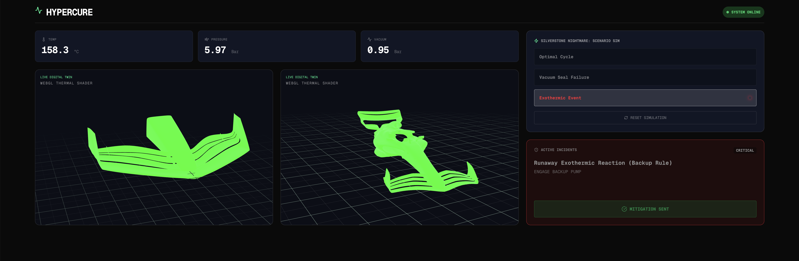
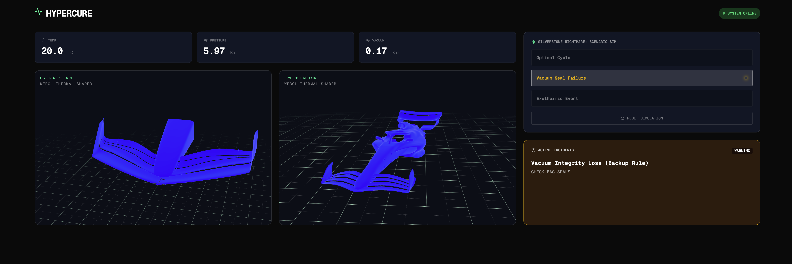
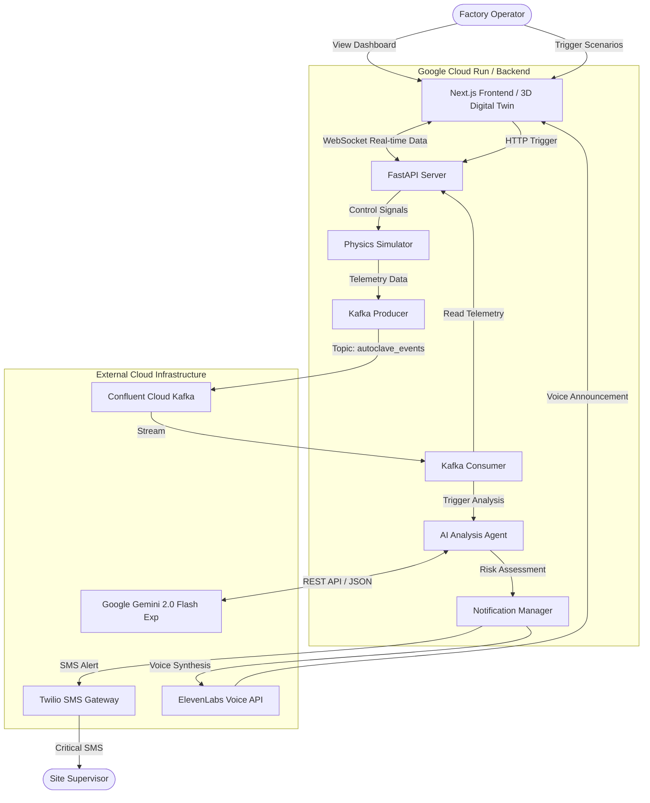
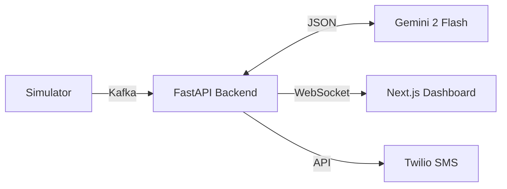

# HyperCURE - Manufacturing Assurance
HyperCURE Frontend UI

[HyperCURE Backend and AI Orchestration](https://github.com/mikoaro/hypercure-backend)






### **1. System Architecture**




#### **Architecture Flow**

1. **Simulation Layer:** A Python-based physics engine generates 4Hz telemetry (Temp, Pressure, Vacuum) simulating real-world autoclave curing cycles for Hexcel 8552 carbon fiber.
2. **Data Ingestion:** Telemetry is serialized (JSON Schema) and pushed to **Confluent Cloud Kafka** (`autoclave_events` topic).
3. **Backend Processing (FastAPI):**
* Consumes the Kafka stream.
* Filters "Ghost" alerts using state-aware logic.
* Broadcasts live telemetry to the frontend via WebSockets.


4. **Cognitive Layer (Gemini 2 Flash):**
* Analyzes anomaly signatures (Vacuum Loss, Exotherms, Pressure Drops).
* References a RAG-like internal knowledge base of material specs.
* Returns JSON-structured risk assessments and mitigation protocols.


5. **Notification Layer:**
* **Twilio:** Sends debounced SMS alerts to supervisors for critical risks.
* **ElevenLabs:** Generates real-time synthetic voice warnings for the control room.


6. **Presentation Layer (Next.js):**
* Renders a WebGL 3D Digital Twin with thermal shaders.
* Displays real-time charts and AI recommendations.


```markdown
# HyperCure: AI-Native Autoclave Monitoring System

**HyperCure** is a next-generation industrial monitoring platform designed for high-performance composite manufacturing. It combines a real-time physics simulator, a high-fidelity 3D digital twin, and multimodal AI analysis to prevent catastrophic failures during the curing process of carbon fiber components.

Powered by **Google Gemini 2 Flash**, **Confluent Cloud**, and **Next.js**, HyperCure doesn't just detect errors—it predicts them and prescribes immediate mitigation strategies via Voice and SMS.


```

## 🚀 Key Features

* **Real-Time Digital Twin:** A WebGL-powered 3D visualization of the autoclave chassis with dynamic thermal shaders that react to live temperature data.
* **Physics Simulation Engine:** Simulates normal curing cycles and "Silverstone Nightmare" scenarios (Exotherms, Vacuum Leaks, Pressure Failure) at 4Hz.
* **Cognitive Anomaly Detection:** Uses Google Gemini 2 Flash via Direct REST API to analyze telemetry against Hexcel 8552 material specifications.
* **Multi-Channel Alerting:**
    * **Visual:** Dynamic dashboard with color-coded risk levels.
    * **Audio:** ElevenLabs synthetic voice announces critical failures.
    * **Mobile:** Twilio SMS integration sends alerts to supervisors (debounced to prevent spam).
* **Resilient Architecture:** Includes deterministic fallback logic and rate-limit handling to ensure safety protocols persist even if AI services are unreachable.

---

## 🏗️ Architecture

### High-Level Diagram


### Technology Stack

* **Frontend:** Next.js 16, React Three Fiber (3D), Tailwind CSS, Lucide React.
* **Backend:** Python 3.14, FastAPI, Uvicorn.
* **Data Streaming:** Confluent Cloud (Apache Kafka), Schema Registry.
* **AI & Logic:** Google Gemini 2 Flash (Experimental), Python Requests.
* **Notifications:** Twilio (SMS), ElevenLabs (Text-to-Speech).
* **Deployment:** Google Cloud Run (Serverless).

---

## 🛠️ Setup & Installation

### Prerequisites

* Python 3.14+
* Node.js 22+
* Google Cloud SDK (`gcloud`)
* Docker (for containerization)

### 1. Environment Configuration

Create a `.env` file in the `backend` directory with the following credentials:

```bash
# Google Cloud & AI
PROJECT_ID="your-project-id"
VERTEX_AI_LOCATION="us-central1"
GEMINI_API_KEY="your-gemini-api-key"

# Confluent Cloud (Kafka)
BOOTSTRAP_SERVERS="your-bootstrap-server:9092"
CONFLUENT_API_KEY="your-kafka-key"
CONFLUENT_API_SECRET="your-kafka-secret"
SCHEMA_REGISTRY_URL="your-schema-registry-url"
SCHEMA_REGISTRY_API_KEY="your-sr-key"
SCHEMA_REGISTRY_API_SECRET="your-sr-secret"

# Notifications
TWILIO_ACCOUNT_SID="your-twilio-sid"
TWILIO_AUTH_TOKEN="your-twilio-token"
TWILIO_FROM_NUMBER="+15550000000"
TWILIO_TO_NUMBER="+15559999999"
ELEVENLABS_API_KEY="your-elevenlabs-key"
ELEVENLABS_VOICE_ID="your-voice-id"

```

### 2. Backend Setup

```bash
cd backend
python -m venv venv
source venv/bin/activate  # On Windows: venv\Scripts\activate
pip install -r requirements.txt
uvicorn app.api:app --reload --port 8080

```

### 3. Frontend Setup

```bash
cd frontend
npm install
# Create .env.local with: NEXT_PUBLIC_API_URL=http://localhost:8080
npm run dev

```

Access the dashboard at `http://localhost:3000`.

---

## ☁️ Deployment (Google Cloud Run)

The backend is fully containerized and optimized for Cloud Run.

1. **Authenticate & Set Project:**
```bash
gcloud auth login
gcloud config set project your-project-id

```


2. **Build Container:**
```bash
gcloud builds submit --tag gcr.io/your-project-id/hypercure-backend:v1 .

```


3. **Deploy Service:**
```bash
gcloud run deploy hypercure-backend \
  --image gcr.io/your-project-id/hypercure-backend:v1 \
  --platform managed \
  --region us-central1 \
  --allow-unauthenticated \
  --port 8080 \
  --set-env-vars GEMINI_API_KEY="...",TWILIO_ACCOUNT_SID="..." # Add all env vars here

```


---

## 🎮 Simulation Scenarios

The dashboard includes a "Silverstone Nightmare" panel to trigger specific failure modes:

1. **Optimal Cycle:** Resets physics to nominal parameters (Temp 20°C, Vacuum 0.98 bar).
2. **Vacuum Seal Failure:** Simulates a bag leak. Vacuum pressure drops to < 0.2 bar. AI triggers a **Warning (Yellow)** alert.
3. **Exothermic Event:** Simulates a runaway reaction. Temperature spikes rapidly. AI triggers a **Critical (Red)** alert, SMS notification, and Voice warning.
4. **Pressure Loss:** Simulates compressor failure. Pressure drops below 4 bar. AI triggers a **Warning (Orange)** alert.

## 🛡️ Reliability Features

* **Rate Limiting:** The AI Agent throttles requests to respect API quotas, falling back to deterministic physics rules if the limit is reached.
* **Log Dampening:** Backend logs are filtered to prevent console flooding during high-frequency telemetry events.
* **Debounced Alerts:** SMS notifications are strictly throttled (1 per 5 minutes) to prevent quota exhaustion and operator fatigue.

---

**HyperCure** — *Manufacturing Intelligence, Evolved.*

```

```